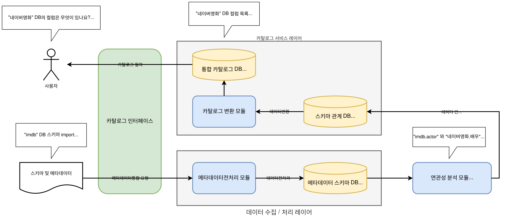

# 액티브 메타데이터 스키마

[](https://www.python.org/downloads/)
[]([#](https://hub.docker.com/layers/library/postgres/17.4/images/sha256-48f04a5009fe444f00178907dd32f6df809246a959468f72248284752f31dadd))
[]([#](https://www.postgresql.org/download/))

## 개요



다양한 데이터 소스의 메타데이터를 수집, 통합, 변환 및 저장하기 위한 스키마입니다.

이 시스템은 서로 다른 형식의 메타데이터를 표준화된 통합 카탈로그로 변환하여 조직 전체의 데이터 자산을 효율적으로 관리하고 활용할 수 있도록 지원합니다.

## 주요 기능

- 다양한 데이터 소스(공공데이터포털, 써드파티 데이터 등)로부터 메타데이터 수집
- 이기종 메타데이터 형식(DCAT/RDF, Schema.org/JSON 등)의 통합 변환
- 메타데이터 품질 검증 및 보강
- 확장 가능한 메타데이터 저장소 구축
- 메타데이터 검색 및 조회 기능
- [컬럼 간 연관성 분석](https://github.com/ThirdActiveDataExTech/RelationalSchemaMatching) 결과 기반 매핑

## 기대 효과

- 다양한 소스의 메타데이터를 일관된 방식으로 통합 관리
- 메타데이터 수집 및 처리 자동화로 운영 효율성 증대
- 메타데이터 기반 데이터 검색성 및 활용성 향상
- 데이터 카탈로그 구축을 통한 조직 전체 데이터 자산 가시성 확보

---

# 스키마 구조

## 1. catalog_entry 테이블

**DCAT 기반 메타데이터 통합 저장 테이블**

| 컬럼명 | 데이터타입 | 제약조건 | 설명 |
|--------|------------|----------|------|
| id | SERIAL | PRIMARY KEY | 고유 식별키 |
| title | TEXT | | 데이터셋/배포판 제목 (dct:title) |
| description | TEXT | | 데이터셋/배포판 설명 (dct:description) |
| issued | DATE | | 최초 발행일 (dct:issued) |
| modified | DATE | | 최종 수정일 (dct:modified) |
| identifier | TEXT | NOT NULL UNIQUE | DCAT 기준 고유 식별자 (dct:identifier) |
| publisher | TEXT | | 발행처 이름 정보 (dct:publisher) |
| keyword | TEXT[] | | 주제 키워드 배열 (dcat:keyword) |
| landing_page | TEXT | | 데이터셋 웹 페이지 URL (dcat:landingPage) |
| theme | TEXT[] | | 주제 분류 URI/코드 배열 (dcat:theme) |
| access_url | TEXT | | 배포판 접근 URL (dcat:accessURL) |
| raw_metadata | JSONB | NOT NULL | 원본 메타데이터 전체 (JSON-LD, schema.org, openapi) |
| ingested_at | TIMESTAMPTZ | DEFAULT now() | 데이터 수집 저장 시간 |
| updated_at | TIMESTAMPTZ | DEFAULT now() | 후처리/재매핑 갱신 시각 |

## 2. metadata_entry 테이블

**RDF/JSON 메타데이터의 중첩 구조를 key-value 쌍으로 분해하여 저장하는 테이블**

| 컬럼명 | 데이터타입 | 제약조건 | 설명 |
|--------|------------|----------|------|
| id | SERIAL | PRIMARY KEY | 고유 식별키 |
| metadata_id | TEXT | NOT NULL | 메타데이터 식별키 (동일 값 = 같은 메타데이터에서 추출) |
| ingested_at | TIMESTAMPTZ | DEFAULT now() | 시스템 수집 일시 |
| metadata_schema | TEXT | NOT NULL | 원본 메타데이터 스키마명 |
| value | TEXT | | 원본 메타데이터 값 |

## 3. column_relation 테이블

**카탈로그 컬럼과 메타데이터 컬럼 간의 매핑 관계 및 연관성 점수를 저장하는 테이블**

| 컬럼명 | 데이터타입 | 제약조건 | 설명 |
|--------|------------|----------|------|
| id | SERIAL | PRIMARY KEY | 고유 식별키 |
| catalog_column | TEXT | NOT NULL | 카탈로그 테이블의 컬럼명 |
| correlation | REAL | NOT NULL | 컬럼 간 연관성 점수 (0.0-1.0 범위) |
| metadata_column | TEXT | NOT NULL | 메타데이터 테이블의 컬럼명 |

## 설계 근거

### catalog_entry
- DCAT 3.0 표준의 Dataset과 Distribution 클래스에서 권장되는 핵심 속성들을 스키마로 선정
- 다양한 데이터 소스와 포맷에서 호환성이 높고 결측치가 적은 컬럼을 우선 포함
- raw_metadata 필드를 통해 원본 메타데이터를 보존하여 확장성 확보

### metadata_entry
- 복잡한 중첩 구조의 메타데이터를 평면화하여 분석 및 처리 용이성 확보
- 스키마별 값 분리를 통한 유연한 데이터 변환 및 매핑 지원

### column_relation
- 컬럼 간 연관성 분석 결과 기반 매핑 자동화를 위한 예측 결과 저장
- 메타데이터와 카탈로그 간 의미적 연관성 정량화

---

## 레포지토리 구조

```
active-metadata-management/
├── apps/
│   ├── metadata-ingestion/         # 데이터 수집 / 처리 레이어
│   └── catalog-service/            # 카탈로그 서비스 레이어
├── initdb/                         # 데이터베이스 스키마 정의
│   ├── 001_init.sql                # 초기 설정
│   ├── 002_catalog_entry.sql       # 통합 카탈로그 DB 스키마
│   ├── 002_metadata_entry.sql      # 메타데이터 스키마 DB 스키마
│   └── 002_column_relation.sql     # 스키마 관계 DB 스키마
├── sample/                         # 테스트용 메타데이터 샘플
└── docker-compose.yaml             # 전체 시스템 오케스트레이션
```

## 서비스 아키텍처

- **metadata-ingestion**: 스키마 및 메타데이터 수집/전처리
- **catalog-service**: 통합 카탈로그 질의 및 데이터 변환
- **PostgreSQL**: 메타데이터 스키마 DB, 통합 카탈로그 DB, 스키마 관계 DB

---

## 사용 방법

```bash
$ docker compose up -d
```

### 데이터 처리 흐름
1. **메타데이터 수집**: 다양한 소스에서 원본 메타데이터 수집
2. **변환 처리**: metadata_entry 테이블에 key-value 구조로 분해 저장
3. **통합 저장**: catalog_entry 테이블에 DCAT 표준 형식으로 통합 저장
4. **관계 매핑**: column_relation 테이블에 컬럼 간 연관성 정보 저장
