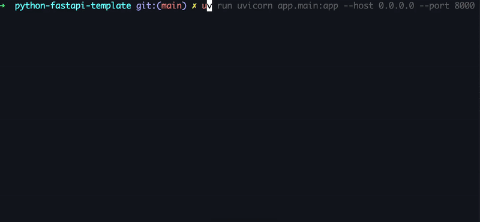
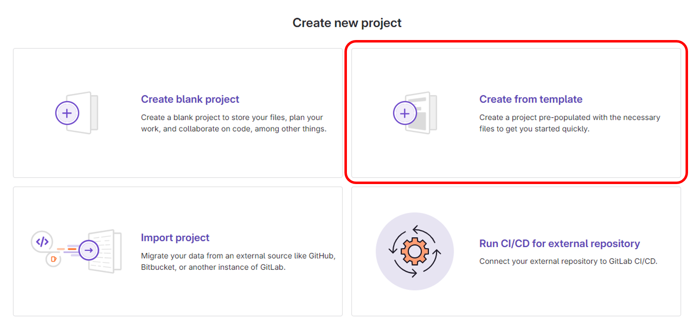
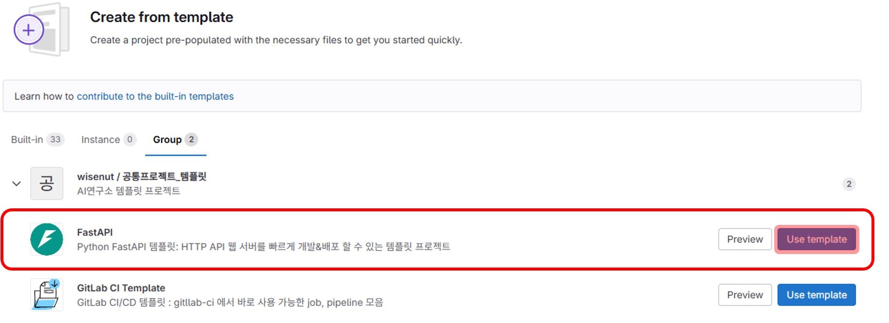

# Python FastAPI Template

[](https://www.python.org/downloads/)
[](https://fastapi.tiangolo.com/release-notes/#01110)
[](https://loguru.readthedocs.io/en/stable/project/changelog.html)
[](https://gunicorn.readthedocs.io/en/stable/project/changelog.html)
[](https://results.pre-commit.ci/latest/github/pre-commit/pre-commit/main)
[](https://gitlab.com/wisenut-research/lab/starter/python-fastapi-template/-/graphs/main/charts)
[](https://gitlab.com/wisenut-research/lab/starter/python-fastapi-template/commits/main)

> **빠르고 쉽게 파이썬 기반의 HTTP API 웹 서버를 개발하기 위한 템플릿**  
> (API 명세는 와이즈넛 [Restful API 디자인 가이드](https://docs.google.com/document/d/1tSniwfrVaTIaTT4MxhBRAmv-S_ECcoSFAXlYrsg4K0Y/edit#heading=h.60fu2rc04bck)를 따른다)

<hr>

**Documentation** : https://labs.wisenut.kr/clusters/local/namespaces/mkdocs/services/pft-mkdocs/public/latest/    
**Source Code**: https://gitlab.com/wisenut-research/starter/python-fastapi-template

<hr>

Python FastAPI Template 은 아래와 같은 특징을 갖고 있다.

1. **Python 3.9, 3.10, 3.11, 3.12**: 높은 호환성
2. **MSA 환경을 고려한 Cloud Native Application 설계**: [THE TWELVE-FACTOR APP](https://12factor.net/)
3. **간편한 Logging 설정**: [loguru](https://github.com/Delgan/loguru)
4. **최신 의존성 관리 툴 uv**: `pyproject.toml`으로 한 번에 관리
5. **App Properties Management**: 환경 변수를 통한 전체적인 프로젝트 변수를 간단하게 관리 ([.env](./.env))
6. **Containerizing with Gitlab CI**:
    - (Cloud Environment) 배포에 사용할 `Dockerfile`
    - (Non-Cloud environment) 분산 처리를 위한 Gunicorn 프리셋 구성을 위한 `gunicorn.Dockerfile`
    - 로컬에서 빠른 개발 환경 구동을 위한 `dev.Dockerfile`
7. **Gunicorn**: multi process 환경 구성
8. **파이썬 앱 개발부터 배포까지 필요한 GitOps와 문서 템플릿 제공**: secret detection, lint test(ruff, pyright, hadolint), unit test(pytest, SAST), deploy, container scanning, triage, mkdocs

### Requirements

- [Python](https://www.python.org/) `>=3.9,<=3.12`
- [uv](https://docs.astral.sh/uv/) `>= 0.5.11`
- [FastAPI Web Framework](https://fastapi.tiangolo.com/ko/)

## Quick start



### 0. Create Project from template

> 빠른 프로젝트 생성을 위한 GitLab Template 사용법
> 

1. GitLab `Create new project` 을 통해 새로운 프로젝트 생성
2. `Create from template` 선택    
   
3. `Group` 선택
4. **FastAPI**에서 `Use template` 선택    
   
5. _Project name, Project description (optional)_ 등을 작성하고 `Create project` 선택


### 1. Install Requirements

> [uv 공식문서](https://docs.astral.sh/uv/getting-started/installation/#installing-uv) 참고

### macOS and Linux
```bash
$ curl -LsSf https://astral.sh/uv/install.sh | sh
```

### Windows
```powershell
$ powershell -c "irm https://astral.sh/uv/install.ps1 | iex"
```

### 2. Install Dependencies

```bash
$ uv sync
```

### pyCharm Interpreter 설정
- pyCharm이 .venv 를 인식하도록 새로 생성하고, uv 로 .venv 에 의존성 설치하는 방법
- [pyCharm이 uv 환경 지원을 릴리즈하면 수정할 예정](https://youtrack.jetbrains.com/issue/PY-70533/Support-package-management-via-uv) 

1. `/.venv/` 존재할 경우 삭제 
2. [Settings] - [Project:<<YOUR_PROJECT_NAME>>] - [Python Interpreter] - [Add Interpreter]
3. Interpreter 위치 선택(default: Local Interpreter)
4. Generate New, Virtualenv 선택 후 생성
5. `uv sync` 로 의존성 설치

### 3. Run app

[방법 1] 가상환경 자동 진입

```bash
$ uv run uvicorn app.main:app --host 0.0.0.0 --port <port number>
```

[방법 2] 가상환경 직접 진입

```bash
# 가상환경 활성화 후 FastAPI uvicorn 실행
$ source .venv/bin/activate
(.venv) $ uvicorn app.main:app --host 0.0.0.0 --port <port number>
```

## Quick start with Docker

```bash
$ docker build -t python-fastapi-template:dev -f dev.Dockerfile .
$ docker run -d --rm --name python-fastapi-template -p 8000:8000 -e X_TOKEN=wisenut python-fastapi-template:dev
```

---

## Project Description

> 프로젝트 생성, 환경 세팅, 실행방법, 앱 구조, GitLab CI/CD 파이프라인, Gunicorn 및 내부망 환경에 대해 더 자세히 알고싶으면 [Python FastAPI 문서](https://labs.wisenut.kr/clusters/local/namespaces/mkdocs/services/pft-mkdocs/public/latest/)를 확인하세요.
>
